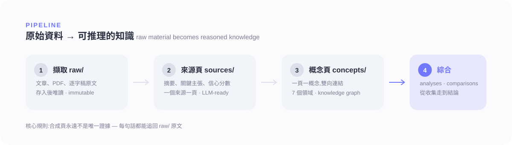
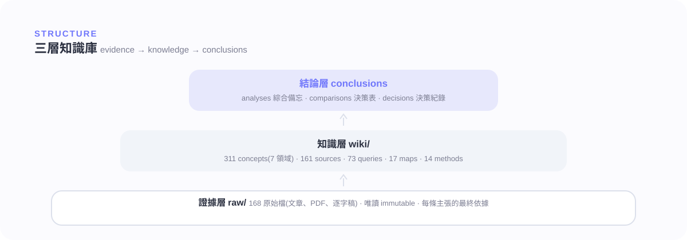
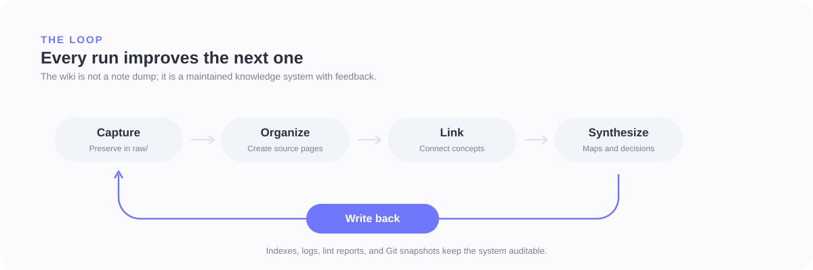

# LLM-Wiki

A personal, AI-maintained Obsidian knowledge base for turning raw source material into a durable, linked Markdown wiki.

Think of Obsidian as the visual IDE, this repository as the knowledge codebase, and AI agents as the librarian/compiler that preserves evidence, builds source notes, links concepts, and records every meaningful change.



## What This Repository Contains

- `raw/` stores immutable source evidence: PDFs, web captures, transcripts, notes, and local attachments.
- `wiki/` stores the compiled knowledge layer: source records, concepts, methods, maps, analyses, playbooks, projects, queries, and decision records.
- `CLAUDE.md` and `AGENTS.md` define the operating rules that AI agents follow when ingesting, querying, linting, or maintaining the vault.
- `scripts/` contains maintenance tools for linting, LLM-readiness backfill, draft validation, question harvesting, and local RAG-style querying.
- `index.md`, `wiki/index.md`, `wiki/overview.md`, `log.md`, and `wiki/logs/change-log.md` act as the navigation and audit trail.

The core rule is simple: preserve source truth in `raw/`, then compile useful, linked knowledge in `wiki/`.

## Current Shape



| Area | Current count | Notes |
| --- | ---: | --- |
| Raw files | 306 | Preserved under `raw/` and treated as source evidence |
| Source pages | 172 | 149 currently marked `llm_ready: true` |
| Concept pages | 324 | Grouped by domain under `wiki/concepts/` |
| UX research methods | 14 | Method pages with use cases, quality bars, and LLM guidance |
| Topic maps | 15 | Navigation hubs and source-readiness dashboards |
| Comparisons | 4 | Decision matrices across methods, tools, and frameworks |
| Analyses | 3 | Synthesized memos built from multiple sources |
| Playbooks | 6 | Reusable operating and review workflows |
| Projects | 8 | Active or completed project pages |
| Saved queries | 73 | Reusable answers and research prompts |
| Decision records | 4 | Lightweight UX/Product decision records |

Concept clusters:

| Cluster | Concept pages |
| --- | ---: |
| UX research | 108 |
| AI agents and agentic engineering | 82 |
| Infrastructure and design systems | 54 |
| Robotics and spatial AI | 31 |
| Product management | 28 |
| Agent experience | 18 |
| Cognitive science | 3 |

Start from [wiki/overview.md](wiki/overview.md) for synthesis, [wiki/index.md](wiki/index.md) for the Obsidian dashboard, or [index.md](index.md) for the top-level catalog.

## Directory Map

```text
LLM-Wiki/
|-- CLAUDE.md              # short agent entry schema
|-- AGENTS.md              # full operating rules for AI agents
|-- README.md              # GitHub-facing project overview
|-- index.md               # top-level content catalog
|-- log.md                 # append-only operations log
|-- dashboard.base         # Obsidian Bases dashboard
|-- raw/                   # immutable source material
|   |-- files/             # local files and attachments
|   `-- web/               # captured web sources
|-- assets/
|   `-- readme/            # README diagrams
|-- scripts/               # audit, lint, ingest, draft, and query tools
`-- wiki/
    |-- overview.md        # evolving synthesis of the whole wiki
    |-- index.md           # Obsidian dashboard and graph entry point
    |-- sources/           # one page per ingested source
    |-- concepts/          # durable concepts grouped by cluster
    |-- methods/           # UX research method pages
    |-- maps/              # topic maps and dashboards
    |-- comparisons/       # decision matrices
    |-- analyses/          # synthesized memos
    |-- canvases/          # Obsidian Canvas visual workflows
    |-- playbooks/         # reusable operating checklists
    |-- projects/          # active initiatives
    |-- decisions/         # UX/Product decision records
    |-- queries/           # saved questions and answers
    |-- drafts/            # staged pages for safe promotion
    |-- logs/              # change logs and lint reports
    `-- _templates/        # reusable page templates
```

## How The Workflow Works



1. Add or capture a source in `raw/`.
2. Ask an AI agent to ingest it.
3. The agent creates or updates a `wiki/sources/` page with provenance, summary, key claims, caveats, linked concepts, LLM-use guidance, and reliability notes.
4. Reusable ideas are connected to `wiki/concepts/`, `wiki/methods/`, `wiki/comparisons/`, `wiki/analyses/`, or `wiki/maps/` as needed.
5. Navigation pages and logs are updated so the wiki stays queryable and auditable.
6. Future queries use `llm_ready: true` sources first, then return to `raw/` for verification when claims matter.

Useful prompts:

```text
Ingest everything new in raw/ into the wiki.
```

```text
Query the wiki: what are the main design implications of Agent Skills?
```

```text
Lint the wiki and fix low-risk issues.
```

```text
Create a topic map for the current wiki.
```

## Local Use

Open this folder as the Obsidian vault:

```text
D:\Obsidian\LLM-Wiki
```

This repository is maintained as a local Obsidian vault first and a GitHub backup/audit trail second. Day-to-day reading and graph navigation happen in Obsidian; Git records publishable snapshots and structural changes.

## For AI Agents

Read [CLAUDE.md](CLAUDE.md) first, then [AGENTS.md](AGENTS.md).

Required behavior:

- Preserve `raw/`; never edit raw evidence unless explicitly instructed.
- Update existing wiki pages before creating duplicates.
- Keep `ingest_level`, `coverage`, `llm_ready`, and `raw_preserved` honest.
- Use vault-rooted Obsidian links for new or edited wiki links.
- Log meaningful changes in `log.md` and `wiki/logs/change-log.md`.
- Use the safe draft/review/apply workflow for high-risk or broad graph edits.
