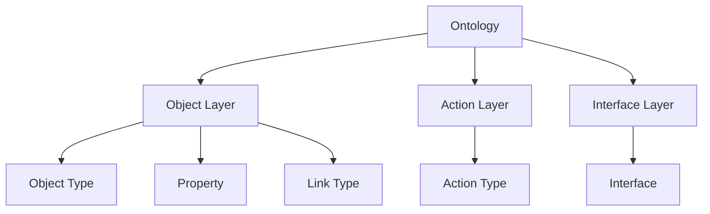

# Palantir Foundry Ontology

## Summary
An ontology framework used by Palantir Foundry to define how data is structured as objects and relationships. In the context of the [[sources/hsol-ai-portfolio-6|LLM Wiki]], it refers to the adoption of these enterprise meta-types for personal data management.

> [!important] Why it Matters
> Using a rigorous ontology prevents personal knowledge bases from becoming disorganized. It provides a stable schema that AI agents can use to navigate and query the vault with higher precision.

## Meta-types Structure

## Key Claims
- The ontology consists of eight meta-types: **Object Type, Object, Property, Link Type, Link, Action Type, Action, and Interface**.
- Objects represent entities (e.g., a Project, a Company), while Links define the relationships between them.

## Related Concepts
- [[concepts/infrastructure-dev/object-backend|Object Backend]]
- [[concepts/infrastructure-dev/object-graph-mapping|Object-Graph Mapping]]

## Sources
- [[sources/hsol-ai-portfolio-6|AI Portfolio Making (6): A Data Model for a Person]]
