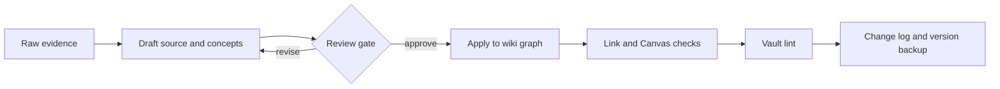

# Safe Ingest Promotion Workflow

## Purpose

Move evidence from `raw/` into the maintained wiki without overwriting source truth, publishing unsupported claims, or mixing a draft with a validated note.

> [!important] Core rule
> Draft first, review the risky parts, apply second, and validate last. `raw/` remains immutable evidence throughout.

## Workflow

## 1. Capture

- Preserve the original file, PDF, or raw source card.
- Record the URL, author, publication date, capture method, and coverage.
- Do not paste a copyrighted article in full when a summary and source link preserve enough evidence.
- If extraction is incomplete, mark the gap instead of reconstructing unsupported details.

## 2. Draft

- Create or enrich one `wiki/sources/` record.
- Extract only durable concepts that are missing from the graph.
- Route method evidence to `wiki/methods/`, decision comparisons to `wiki/comparisons/`, and cross-source synthesis to `wiki/analyses/`.
- Separate source claims, agent interpretation, and open questions.

### Drafting lanes

- **Codex:** current primary lane; can inspect files, edit the graph, and run verification.
- **Ollama:** optional local lane. Ollama is installed on this machine, but no local models were present on 2026-07-02. Do not describe this lane as operational until a model and structured-output check are configured.

## 3. Review gate

Human review is required before applying claims or recommendations involving:

- participant consent, privacy, safety, or vulnerable populations;
- legal, medical, financial, or employment decisions;
- deletion, renaming, or broad graph rewrites;
- low-confidence or contradictory sources;
- product defaults, personalization, or monetization that could become dark patterns;
- external publication or GitHub push.

Low-risk additions can be applied directly when provenance, scope, and validation are clear.

## 4. Apply

- Keep raw captures unchanged.
- Update an existing source or concept before creating a duplicate.
- Add backlinks from the relevant map, method, concept, and index.
- Preserve uncertainty in frontmatter confidence and caveat sections.
- Record meaningful structure changes in both logs.

## 5. Maintenance gate

Run the smallest relevant checks first:

1. Confirm every new raw and source path exists.
2. Check every new wikilink target literally.
3. Parse every new `.canvas` as JSON and validate edge endpoints.
4. Run `python scripts/lint.py`.
5. Inspect `git diff --check` and the final status before any commit or push.

## Output Contract

- Raw evidence is present.
- Source readiness fields are honest.
- Durable concepts are linked, not duplicated.
- High-risk claims carry explicit limits.
- The relevant map and indexes expose the new knowledge.
- Lint and focused link checks pass or the remaining issues are named.

## Related

- [[maps/llm-wiki-architecture|LLM Wiki Architecture]]
- [[maps/llm-wiki-visual-workflows|LLM Wiki Visual Workflows]]
- [[concepts/infrastructure-dev/llm-wiki|LLM Wiki]]
- [[concepts/ai-agents/ai-maintained-wiki|AI-Maintained Wiki]]
- [[concepts/infrastructure-dev/knowledge-linting|Knowledge Linting]]
